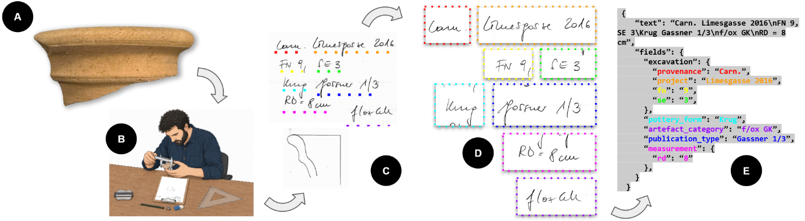

# 🏺CENTURIA
A benchmark for handwritten text recognition and structured field extraction from archaeological pottery records.

This repository contains the CENTURIA dataset, the evaluation pipeline, and fine-tuned checkpoints for transcribing and extracting structured metadata from the Carnuntum pottery archive.
It is part of the [LEGION project](https://legion-hsa-2-0.github.io/).

The preprint is available on [arxiv](https://doi.org/10.48550/arXiv.2608.30616).

## 📄 Abstract


<p align="center">
  <em>
    <b>From analogue archaeological documentation to structured metadata.</b>
    <b>A:</b> Excavated sherd,
    <b>B:</b> Manual documentation by a specialist,
    <b>C:</b> Scanned handwritten record (retro-digitized),
    <b>D:</b> Automatically transcribed fields (HTR),
    <b>E:</b> Structured machine-readable metadata (KIE)
  </em>
</p>

Pottery is a primary source for reconstructing the chronological and economic dimensions of past societies. 
Archaeologists often document ceramic finds through technical drawings and handwritten metadata. 
This metadata is critical for dating, provenance attribution, and cross-site comparison, but remains inaccessible to computational analysis, requiring manual transcription of every record. 
We investigate whether state-of-the-art document analysis models can address this task, and introduce CENTURIA, a dataset of 507 pottery records from the Roman site of Carnuntum, providing transcriptions, bounding boxes, and structured field-level labels across seven metadata categories. 
Benchmarking five OCR models reveals a substantial domain gap: zero-shot transcription error reaches 15-32% SpACER-M, far exceeding rates on printed archival documents, with domain-specific fields recovered in fewer than 3% of cases. 
LoRA fine-tuning on just 57 samples, reflecting a realistic archival annotation budget, closes this gap, reducing transcription error to below 1.5%  and recovering overall field-level accuracy above 87%. 
Our results show that a small expert-validated fine-tuning set suffices to convert handwritten pottery documentation into structured, searchable metadata ready for archaeological databases. 

## 📂 Dataset

## 🤖 Models and checkpoints
| Model | #Parameters | Baseline Checkpoint | Our Fine-tuned Checkpoint
|-------|-------------|---------------------|----------------------|
| TrOCR | 558M | [microsoft/trocr-large-handwritten](https://huggingface.co/microsoft/trocr-large-handwritten) | - |
| Florence2 | 770M | [florence-community/Florence-2-large](https://huggingface.co/florence-community/Florence-2-large) | - |
| olmOCR | 7B | [allenai/olmOCR-7B-0225-preview](https://huggingface.co/allenai/olmOCR-7B-0225-preview) | - |
| olmOCR2 | 7B | [allenai/olmOCR-2-7B-1025](https://huggingface.co/allenai/olmOCR-2-7B-1025) | link |
| LightOnOCR | 1B | [lightonai/LightOnOCR-2-1B](https://huggingface.co/lightonai/LightOnOCR-2-1B) | link |

Models without a fine-tuned checkpoint are evaluated zero-shot. Fine-tuning uses LoRA (57 samples, 2 epochs).

## 📊 Evaluation

## 📝 Citation
If you find our work useful, we'd appreciate it if you cite us:

```bibtex
@misc{naghavi2026centuria,
      title={{OCR}-Based Field Extraction for Archaeological Pottery Metadata: The {CENTURIA} Dataset}, 
      author={Gissu Valentina Naghavi and Dominik Hagmann and Martin Kampel and Irene Ballester},
      year={2026},
      eprint={2608.30616},
      archivePrefix={arXiv},
      primaryClass={cs.CV},
      url={https://arxiv.org/abs/2608.30616}
}
```


## 🙏 Acknowledgements
This work was carried out within the project LEGION (machine **LE**arnin**G**-enabled **I**dentification of archaeological **O**bjects in the middle da**N**ube river basin). 
The project is funded by the Austrian Academy of Sciences (OeAW) through the Heritage Science Austria 2.0 program (grant number: Heritage_2024-12_LEGION).

## ⚖️ License
This project is licensed under the CC-BY 4.0 License.
